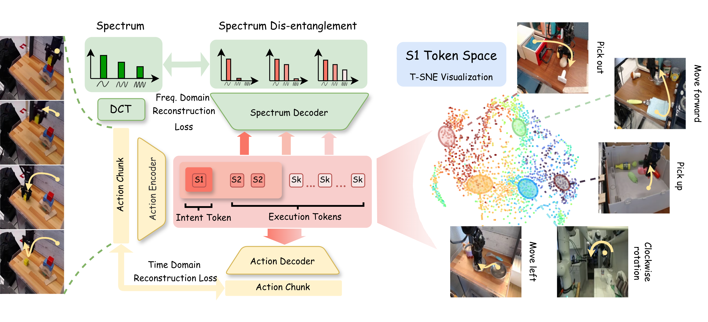
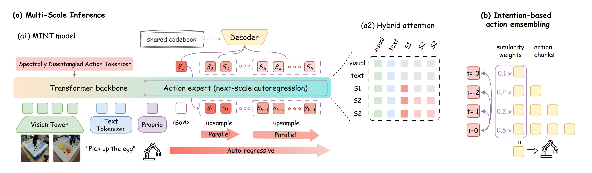

<div align="center">
  <h1>Mimic Intent, Not Just Trajectories</h1>
  <p><strong>An intent-to-execution policy for precise and transferable robotic manipulation.</strong></p>

  <p>
    <a href="https://arxiv.org/abs/2602.08602"></a>
    <a href="https://huggingface.co/huangrm/MINT-libero"></a>
    <a href="https://huggingface.co/huangrm/MINT-tokenizer-libero"></a>
  </p>

  <p>
    
    
    
  </p>
</div>

<div align="center">
  
  <p style="text-align:left;"><em>SDAT maps each action chunk into multi-scale tokens: coarse tokens capture <strong>intent</strong>, and fine tokens capture <strong>execution details</strong>. The S1 token space forms behavior-level clusters.</em></p>
  
  <p style="text-align:left;"><em>MINT predicts tokens from intent to execution with next-scale autoregression, then decodes them into actions. Intent-based ensemble improves long-horizon stability.</em></p>
</div>

---

## Overview ✨

We introduce MINT (Mimic Intent, Not just Trajectories), a framework for end-to-end imitation learning in dexterous manipulation. MINT explicitly <span style="background-color:#e0f2fe;color:#075985;padding:0 4px;border-radius:4px;"><strong>disentangles behavior intent from execution details</strong></span> by learning a hierarchical, multi-scale token representation of actions. Coarse tokens capture global, low-frequency intent, while finer tokens encode high-frequency execution details. Our policy generates trajectories via <span style="background-color:#e0f2fe;color:#075985;padding:0 4px;border-radius:4px;"><strong>next-scale autoregression</strong></span>, performing progressive <span style="background-color:#e0f2fe;color:#075985;padding:0 4px;border-radius:4px;"><strong>intent-to-execution reasoning</strong></span>. This structure enables efficient learning, robust adaptation to environmental dynamics, and <span style="background-color:#e0f2fe;color:#075985;padding:0 4px;border-radius:4px;"><strong>one-shot skill transfer</strong></span> by reusing the intent token from a demonstration. Experiments on simulation and real robots demonstrate strong performance, high generalization, and effective skill transfer.

## Open-Source Roadmap 🗺️

| Track | Scope | Status | Target |
|---|---|---|---|
| ✅ LeRobot Integration | MINT-4B training/evaluation pipeline | Released | Done |
| ✅ Public Weights | LIBERO policy + tokenizer on Hugging Face | Released | Done |
| ✅ SDAT Training | Training scripts + configs | Released | Done |
| 🚧 Lightweight MINT-30M | A lightweight framework | In progress | 2026 H2 |
| 🗓 Multi-dataset Checkpoints | CALVIN / MetaWorld / Bridge policy-tokenizer pairs | Planned | 2026 H2 |
| 🗓 Support Bimanual Manipulation | RoboTwin and other bimanual manipulation benchmarks | Planned | 2026 H3 |

## Installation 🛠️

```bash
conda create -y -n mint python=3.12
conda activate mint

pip install lerobot==0.4.3
# Install LIBERO dependencies via LeRobot:
pip install "lerobot[libero]==0.4.3"

conda install -y ffmpeg -c conda-forge
```

```bash
cd lerobot_policy_mint
pip install -e .
```

Note: If you encounter build errors on Linux, you may also need system packages such as cmake,
build-essential, python3-dev, pkg-config, and FFmpeg development libraries.

```bash
apt-get install cmake build-essential python3-dev pkg-config libavformat-dev libavcodec-dev libavdevice-dev libavutil-dev libswscale-dev libswresample-dev libavfilter-dev
```

## Model Zoo 🧩

### MINT-4B (Lerobot implementation) 🤗
| Dataset | Policy | Tokenizer | Status | Notes |
|---|---|---|---|---|
| LIBERO | [huangrm/MINT-libero](https://huggingface.co/huangrm/MINT-libero) | [huangrm/MINT-tokenizer-libero](https://huggingface.co/huangrm/MINT-tokenizer-libero) | Available | Current public release |
| CALVIN | Coming soon | Coming soon | Planned | Upcoming release |
| MetaWorld | Coming soon | Coming soon | Planned | Upcoming release |
| Bridge | Coming soon | Coming soon | Planned | Upcoming release |

### MINT-30M (A lightweight implementation) ⚡

| Dataset | Policy | Tokenizer | Status | Notes |
|---|---|---|---|---|
| LIBERO | Coming soon | Coming soon | In progress | Upcoming release |
| CALVIN | Coming soon | Coming soon | Planned | Upcoming release |


## Training Example 🏋️

First, download the required tokenizer:

```bash
hf download huangrm/MINT-tokenizer-libero --local-dir <path/to/tokenizer>
```
Or, train your own tokenizer:
```bash
# install tokenizer training dependencies
pip install -r requirements.txt
python -m SDAT.train --config-name train
```

Start training:

```bash
lerobot-train \
    --dataset.repo_id=<your_dataset> \
    --policy.type=mint \
    --output_dir=./outputs/mint_training \
    --job_name=mint_training \
    --policy.repo_id=<your_repo_id> \
    --policy.pretrained_path=huangrm/pi05_base \ # training from pi05 base model
    --policy.vqvae_name_or_path=<path/to/tokenizer> \
    --policy.compile_model=false \
    --policy.gradient_checkpointing=true \
    --policy.dtype=bfloat16 \
    --steps=10000 \
    --policy.device=cuda \
    --batch_size=32
```

## Evaluation 📊

```bash
lerobot-eval \
    --policy.path=huangrm/MINT-libero \
    --policy.vqvae_name_or_path=<path/to/tokenizer> \
    --env.type=libero \
    --env.task=libero_10,libero_object,libero_spatial,libero_goal \
    --eval.batch_size=1 \
    --eval.n_episodes=2 \
    --seed=42 \
    --policy.n_action_steps=4
```


## Citation 📚

If you find this project useful, please cite:

```bibtex
@article{huang2026mimic,
  title={Mimic Intent, Not Just Trajectories},
  author={Huang, Renming and Zeng, Chendong and Tang, Wenjing and Cai, Jintian and Lu, Cewu and Cai, Panpan},
  journal={arXiv preprint arXiv:2602.08602},
  year={2026}
}
```

## Acknowledgement 🙏

This project is built on top of excellent open-source ecosystems.
We sincerely thank the teams behind [LeRobot](https://github.com/huggingface/lerobot)
and [OpenPI](https://github.com/Physical-Intelligence/openpi) for their impactful contributions.

 
